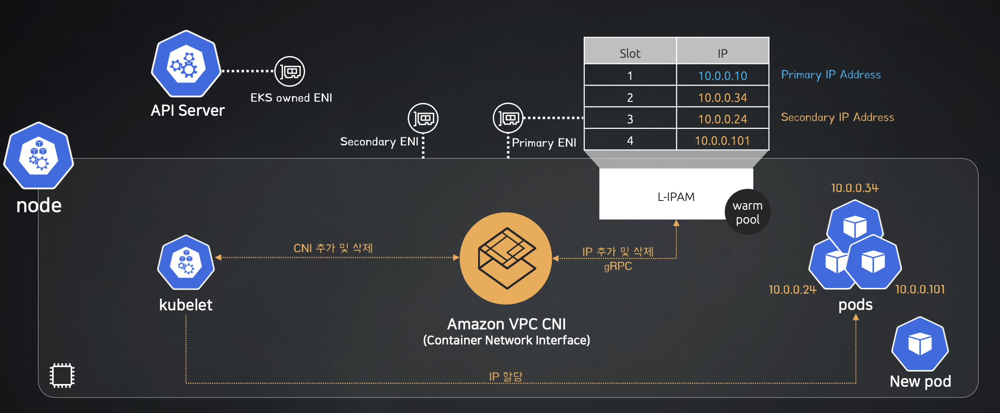

### CNI
CNI(Container Network Interface)는 분산된 노드에 실행중인 Pod간의 통신을 위한 인터페이스이다.  
쿠버네티스에서는 분산된 노드에서 Pod간 통신을 위해서는 CNI를 사용한다.  
  
쿠버네티스는 기본적으로 'kubenet'이라는 자체적인 CNI 플러그인을 제공하지만 기능적인 제한이 있어 Calico와 같은 외부 CNI 플러그인을 사용한다.  
AWS EKS에서는 Amazon VPC CNI 플러그인을 통해 클러스터 네트워킹 환경을 구성한다.  

### Amazon VPC CNI 아키텍처

참고 : CloudNet@와 함께하는 Amazon EKS 기본 강의(인프런)

해당 아키텍처에서 API Service(Control Plane)는 Worker Node인 kubelet에게 Pod를 생성하라고 요청할 것이다. 이 때 VPC CNI는 ENI에서 할당 가능한 Slot에 IP를 추가하고 Pod에 IP를 할당할 것이다.  
만약 ENI의 여분의 Slot이 없는 경우 Secondary ENI를 추가하여 Slot에 IP를 추가한다.  
ENI 사용가능한 최대 갯수는 인스턴스 타입에 따라 다르다.  

### Amazon VPC CNI 구성의 최대 파드 개수
VPC CNI 플러그인같은 경우 인스턴스의 타입과 IP 할당 방식에 따라 최대 파드 수량이 다르다.  
[IP 할당 방식]
1. Secondary IPv4 Address(Max Pods = ENI수 * (ENI당 지원하는 Ipv4수-1) +2)
- ENI별로 첫 번째 IP 주소로 파드에 할당 불가
- Slot에 IP를 할당하는 방식 만약 Slot 부족시 ENI 추가
- 노드별로 구성되는 aws-node와 kube-proxy 파드 2대를 포함하여 산정
- 예를 들어 m5.large(최대 ENI 수 : 3, ENI 당 slot 수 : 10)를 사용하는 경우 3*(10-1)*2 = 29
2. IPv4 Prefix Delegation(Max Pods = ENI수 * (ENI당 지원하는 IPv4수 -1) * 16)
- Slot 당 /28 Prefix(16개)할당
- Nitro System 계열의 인스턴스 유형만 사용 가능
- vCPU 30코어 미만은 110개로 제한, 그 외 250이 최대(Max pods의 계산식과 실제 생성 가능한 Pod의 갯수가 다르다.)
- kubectl 명령으로 IPv4 Prefix Delegation
- 예를 들어 m5.large(최대 ENI 수 : 3, ENI 당 slot 수 : 10)를 사용하는 경우 3*(10-1)*16 = 432지만 m5.xlarge는 vCPU 30코어 미만이므로 110개의 Pod 밖에 생성을 못한다.

### Amazon VPC ENI 장점
- 패킷 캡슐화 없이 통신 가능 오버헤드가 낮음(파드와 노드는 같은 IP대역 이므로)
- VPC Flow Logs, 라우팅 정책, 보안그룹 활용 가능
- VPC에서 트래픽을 파드에게 직접적인 라우팅 가능

### Amazon VPC ENI 단점
- 최대 파드 생성 수에 대한 제약

### Daemonset 정보 확인
# aws-node는 vpc-eni관련
kubectl get daemonset -n kube-system

