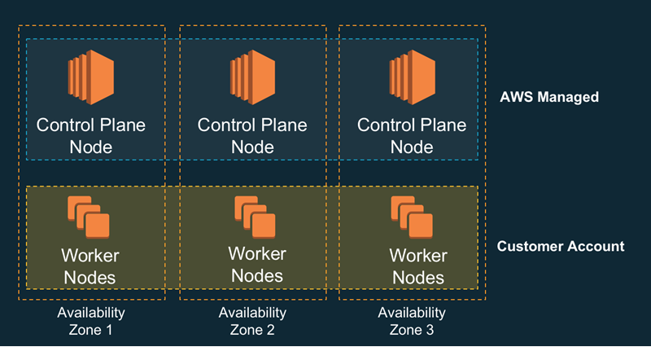

### EKS 란?
Kubernetes 컨트롤 플레인 또는 노드를 제공하는 AWS 관리형 Kubernetes 서비스입니다.
컨트롤 플레인을 직접 구성하지 않고 k8s를 손쉽게 사용할 수 있습니다.  
  
VM 3대를 만들고 K8S 구성해본 경험이 있으면 왜 EKS가 필요하지 더 와 닿을 것 입니다..  
각 VM에 도커 설치하고, swap disable, kubelet 설치 등등 번거로운 작업이 많고 버전에 민감하여 에러가 발생하면 스트레스 받습니다.  
이 때 AWS EKS를 사용하면 이런 스트레스를 줄일 수 있 것 입니다. 대신 클러스터 비용이 추가적으로 나가고 유연성이 떨어집니다..

### EKS 장점
1. 다수의 AWS 가용 영역에 k8S Control Plane 실행
2. 다양한 AWS 서비스와 통합하여 확장성과 보안성 제공
3. K8S 최신 버전을 사용하여 EKS로 손쉬운 마이그레이션

### EKS 클러스터 배포 방법
1. AWS 콘솔
  - 콘솔에서 클릭으로 작업하여 가시성은 좋으나 하나하나 지정해줘야 되기 때문에 불편
2. eksctl
  - EKS 클러스터 생성 및 관리를 돕는 CLI 도구
  - 클러스터 생성을 코드로 관리하기 때문에 생성 및 관리가 편함
  - eksctl 명령어를 익혀야하는 단점은 있음
3. lac(cloudformation, terraform)
  - 코드 기반으로 인프라 관리할 수 있는 도구인 CloudFormation 또는 Terrafrom으로 생성 및 관리
  - eksctl과 마찬가지로 소스로 관리하기 때문에 유지보수가 용이
  - lac 도구를 익혀야하는 단점이 있다.

### EKS Control plane과 Worker Node 아키텍처
[Control Plane]
AWS EKS의 Control plane 아키텍처는 AWS 관리형 VPC(AWS에서 관리하는 계정) 안에 다른 가용영역 3곳에 Control plane을 구성합니다.  
이때 각 가용영역에는 ENI가 구성되어 있고, 1개의 노드 안에는 kube-apiserver, kube-controller-manager, kube-scheduler등이 설치되고 다른 1개의 노드에는 etcd가 설치됩니다.  
  
[Worker Node]
워커 노드도 각각의 가용영역이 구분되어 있고 Control Plane과 달리 사용자 VPC(내 VPC)에 구성됩니다.  
1개의 노드 안에 kubelet, kube-porxy 등이 설치됩니다.  
  
[Control plane과 Worker Node]  
Control Plane은 AWS 관리형 VPC에 설치되어 있고 Worker Node는 사용자 VPC에 설치되어 있으므로 서로 연결은 EKS owned ENI로 되어 있습니다.  
서로 다른 계정이므로 Cross Account ENI로 구성됩니다.  

### Worker Node 구성 방식
Worker Node의 구성 방식은 총 3가지 입니다.
1. 관리형 노드그룹
  - EKS에 최적화된 AMI 사용
  - AMI를 AWS에서 관리
2. 자체 관리형 노드
  - 사용자 정의 AMI 사용
  - 유지 관리 및 버전 관리를 직접 수행
3. AWS Fargate
  - 서버리스 환경에서 동작
  - Micro VM 형태로 할당하여 관리

